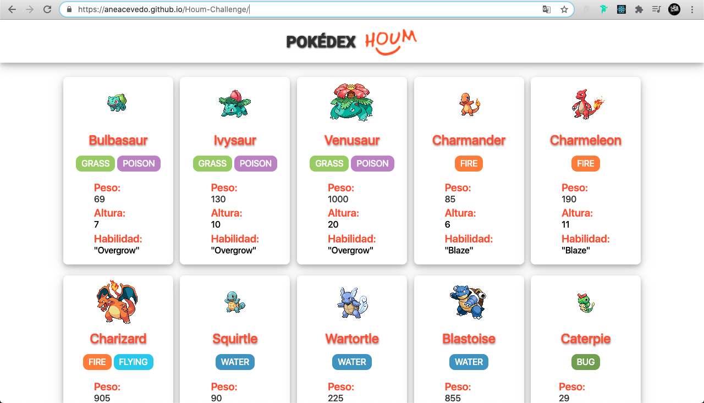
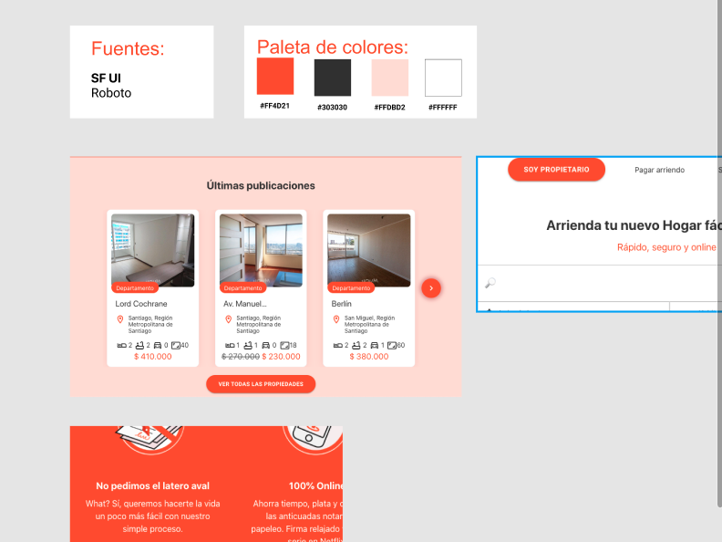

# POKÉDEX Houm

## Índice:

* [1. Pokédex HOUM.](#1-Pokédex-Houm)
* [2. Comenzando a usarla.](#2-Comenzando-a-usarla)
* [3. Proceso de protoripado.](#3-Proceso-de-protoripado)
* [4. Despliegue.](#8-Despliegue)
* [5. Herramientas.](#9-Herramientas)
* [6. Autora.](#10-Autoras)

***

## 1. Pokédex Houm :speech_balloon:

Houm me entregó del desafío de desarrollar una pokédex a través del consumo de PokeApi.
El proyecto muestra todos los pokémons alojados en la data de la Api con sus respectivas imágenes, nombres, tipo, peso, altura y habilidad.
La Pokédex es repsonsiva.
Puedes conocerla y probarla [aquí](https://aneacevedo.github.io/Houm-Challenge/).

## 2. Comenzando a usarla 🚀

Accede a Pokédex Houm por medio de tu navegador y se desplegarán en varias páginas los pokémons con sus fichas en HeroCards.
Puedes verlos todos avanzando por medio de los botones de página ubicados al pie.

## 3. Proceso de prototipado 📋

#### Prototipo de alta fidelidad:
El prototipo de alta fidelidad fue diseñado a través de la plataforma que ofrece Figma, dando énfasis en cómo luciría y el funcionamiento planeado.
Se desarrolló la guía de estilos de los colores corporativos y tipografías de Houm.com

## 4. Despliegue 📦

Puedes acceder al deploy de mi proyecto [aquí](https://aneacevedo.github.io/Houm-Challenge/).

## 5. Herramientas 🛠️

En éste proyecto fueron utilizadas herramientas y tecnologías para llegar al resultado del producto entregado.
Las usadas fueron:

* [Visual Studio Code](https://code.visualstudio.com/) – Para el código.
* [Figma](https://www.figma.com/) – Para el prototipado de alta fidelidad.
* [React Js](https://reactjs.org/) - Librería usada para el proyecto.
* [Node Js](https://nodejs.org/) – Instalaciones de packages.
* [PokeApi](https://pokeapi.co/) – Consumo de ésta api para obtener la data.
* [Git y GitHub](https://github.com/) – Para el Subir repositorio, commits y deploy.

## 6. Autora ✒️

Éste proyecto fue realizado por mi a solicitud de Houm.

* **Anelisse Acevedo Sáez** [GitHub](https://github.com/aneacevedo) :octocat:
